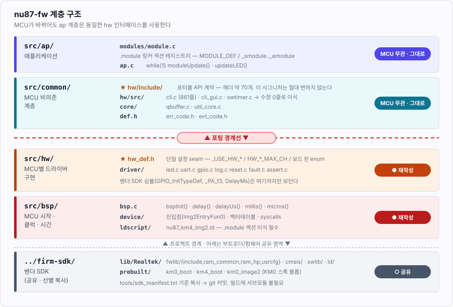

# 00. 개요와 목표

## 0.1 이 작업이 무엇인가

`firmware/nu87-fw`는 원래 **STM32H563 + WIZnet W6300** 프로젝트(`stm32h5-w6300-fw`)였다.
이것을 **NU87 모듈(Realtek RTL8720DF / Ameba-D)** 펌웨어로 바꾼다.

1단계 목표는 소박하다: **RGB LED 점멸 + LOGUART 부팅 로그 + CLI 콘솔**.
그 다음 단계로 WiFi/BLE를 올린다.

## 0.2 최우선 제약 — 계층 경계를 지킨다

이 프로젝트의 존재 이유는 "LED를 깜빡이는 것"이 아니라
**MCU가 바뀌어도 `ap` 계층이 동일한 인터페이스를 쓰게 하는 것**이다.
따라서 이 포팅의 성공 기준은 "동작함"이 아니라 **"계층 경계가 지켜졌는가"** 이다.



### 지켜야 할 규칙

1. **`src/common/`과 `src/ap/`은 손대지 않는다.** `common/hw/include/led.h`의
   `ledInit/ledOn/ledOff/ledToggle(uint8_t ch)` 시그니처는 STM32든 RTL8720DF든 동일하다.
2. **벤더 SDK 타입이 경계를 넘지 못하게 한다.** `GPIO_InitTypeDef`, `_PA_13`, `DelayMs` 같은
   Realtek 심볼은 `src/hw/driver/`와 `src/bsp/` 안에서만 보여야 한다.
   `ap/`에서 `#include "ameba_soc.h"`가 필요해지면 추상화가 실패한 것이다.
3. **드라이버 패턴을 유지한다.** 채널 인덱스 API + `if (ch >= XXX_MAX_CH) return;` 가드 +
   정적 테이블. 기존 `led.c`/`gpio.c`가 그 예다.
4. **`hw_def.h`가 유일한 보드 설정 지점이다.** `_USE_HW_*` 기능 스위치, `HW_*_MAX_CH` 채널 수,
   보드 핀 enum이 전부 여기 모인다.

> 이 원칙이 실제로 얼마나 잘 지켜지는지는 `cli.c`(861줄)가 증명한다. 이 파일은
> `uartAvailable/uartRead/uartWrite` 세 함수에만 의존하므로 **한 줄도 고치지 않고** 이식된다.

## 0.3 아키텍처 결정 요약

| 항목 | 결정 | 근거 |
|---|---|---|
| 빌드 | **CMake 독립 빌드**. SDK는 `firm-sdk/lib/Realtek/`에 선별 복사 후 커밋 | 기존 개발 환경과 동일한 경험 유지. [05](05-build-system.md) |
| SDK 추적 | **서브모듈로 버전만 고정**, 빌드 시엔 불필요 | 출처 증명 + KM0 블롭과의 버전 정합성. [04](04-sdk-vendoring.md) |
| 툴체인 | 표준 **arm-none-eabi-gcc** (`cortex-m33`/`fpv5-sp-d16`/hard) | 검증: multilib `thumb/v8-m.main+fp/hard`가 ROM ABI와 일치 |
| 코어 | **KM4만 개발**, KM0는 SDK 스톡 이미지를 블롭으로 고정 | KM0가 KM4를 리셋에서 풀어주고 WLAN FW를 로드한다. [02](02-chip-architecture.md) |
| RTOS | **1단계 bare-metal**, 무선 단계에서 FreeRTOS 전환 | 기존 구조(`while(1) moduleUpdate()`)와 동일. `osal/thread.c` seam이 이미 있음 |
| 실행 위치 | 1단계는 **전량 SRAM**, 무선 단계에서 XIP 전환 | 456KB SRAM으로 LED+CLI는 충분. 이미지 3파트 복잡도 회피 |
| 플래싱 | **CP2102N UART 자동 다운로드** (주 경로) | 보드에 자동 리셋 회로가 이미 있음. [07](07-flash-download.md) |
| 디버깅 | **OpenOCD + ST-LINK/V2-1** — **실동작 검증 완료** | pyOCD는 실측 실패. [03](03-debug-swd.md) |

## 0.4 단계 계획

| 단계 | 내용 | 문서 | 상태 |
|---|---|---|---|
| **S0** | 하드웨어 실측 분석 | [01](01-hardware.md) | ✅ |
| **S1** | 칩 구조 파악 (듀얼코어/메모리/XIP) — 라이브 칩 실측 | [02](02-chip-architecture.md) | ✅ |
| **S2** | SWD 디버깅 환경 구축 | [03](03-debug-swd.md) | ✅ |
| **S3** | 부팅 흐름 / 이미지 포맷 해석 — 라이브 플래시 실측 | [06](06-boot-image.md) | ✅ |
| **S4** | SDK 참조 빌드 + KM0 블롭 확보 | [04](04-sdk-vendoring.md) | 🚧 |
| **S5** | UART 플래싱 파이프라인 | [07](07-flash-download.md) | 🚧 |
| **S6** | CMake 빌드 성립 + BSP 진입점 | [05](05-build-system.md), [08](08-bsp.md) | 🚧 |
| **S7** | LED 드라이버 → **점멸 확인** | [09](09-driver-led.md) | 🚧 |
| **S8** | UART / LOG / CLI → **콘솔 확인** | [10](10-driver-uart-log-cli.md) | 🚧 |
| **S9** | WiFi / BLE | [11](11-wireless-plan.md) | 📋 |

**S0~S3을 먼저 끝낸 이유**: 이 칩에서 가장 불확실한 부분이 "부팅 진입과 이미지 포맷"인데,
SWD가 붙으면 **라이브 칩의 플래시와 레지스터를 직접 읽어** 추측 대신 사실로 확정할 수 있다.
실제로 그렇게 했고, 문서의 이미지 레이아웃 표는 전부 실측값이다.

## 0.5 기존 프로젝트에서 버리는 것 / 가져가는 것

**그대로 가져간다 (수정 0줄 목표)**
- `src/common/` 전체 — `def.h`, `err_code.h`, `evt_code.h`, `core/qbuffer.c`, `core/util_core.c`,
  `hw/include/` 전체, `hw/src/cli.c`(861줄), `hw/src/cli_gui.c`(573줄), `hw/src/swtimer.c`
- `src/ap/modules/module.c`/`.h` — `.module` 섹션 레지스트리
- `src/ap/ap.c` — `updateLED()`의 `millis()` 델타 패턴, `MODULE_DEF(ap)`

**소폭 수정**
- `src/ap/ap.c` — `#include "iperf.h"` 제거(**원본 저장소에 없는 헤더 — 현재 상태로는 빌드 불가**),
  `update()`에서 `wiznetUpdate()`/`eventUpdate()` 제거
- `src/ap/modules/common/cli/cli_mgr.c` — 텔넷 `cli_net` 제거, LOGUART 단일 포트로
- `src/main.c` — 거의 그대로 (bare-metal `#else` 분기)

**버린다**
- `src/lib/ST/` 전체 (CMSIS, STM32H5 HAL, USB Device Library)
- `src/hw/driver/wiznet/**` (~12k줄) → 무선 단계에서 lwIP가 자리를 대체
- `src/hw/driver/usb/**` + `cdc.c` — RTL8720DF의 네이티브 USB는 Type-C에 연결되지 않음
- `src/bsp/device/stm32*`, `src/bsp/startup/startup_stm32h562xx.s`, STM32 링커스크립트
- `.version` 고정번지 섹션 (`0x08000400`) — Ameba 이미지 포맷과 맞지 않아 평범한 `const`로 변경

## 0.6 검증된 개발 환경

| 항목 | 값 |
|---|---|
| 호스트 | macOS 12.7.6 (arm64) |
| 툴체인 | Arm GNU Toolchain 14.2.Rel1 — multilib `thumb/v8-m.main+fp/hard` |
| CMake / make | 4.4.2 / GNU Make 4.4.1 |
| OpenOCD | 0.12.0 (Homebrew) |
| 디버그 프로브 | ST-LINK/V2-1 (PID `0x3752`), 펌웨어 **V2J46M33** |
| USB-UART | CP2102N → `/dev/cu.usbserial-0001` (macOS 내장 `AppleUSBSLCOM` 드라이버) |
| SDK | `Ameba-AIoT/ameba-rtos-d` @ `7569200f` (2026-06-18), 241MB |

## 0.7 디렉토리 배치

부트로더 프로젝트가 생길 것을 전제로, **보드 단위 자산과 벤더 SDK 를 프로젝트 밖으로 뺐다.**

```
firmware/
├── docs/                       설계 문서 (이 문서)
├── firm-sdk/                   부트로더 / 펌웨어 공유 영역
│   ├── ameba-rtos-d/           git submodule (241MB) — 빌드에 불필요
│   ├── lib/Realtek/                벤더링 결과 (229파일 2.9MB, git 커밋)
│   ├── prebuilt/               KM0 부팅 블롭
│   └── tools/                  sync_sdk.py · extract_blobs.py · manifest · patches
│                               arm-none-eabi-gcc.cmake · openocd/nu87.cfg
├── backup/                     보드 공장 플래시 백업 (4MB)
├── nu87-fw/                    펌웨어 프로젝트
│   ├── CMakeLists.txt
│   ├── prj/nu87-fw.code-workspace
│   └── src/{main.c, ap/, common/, bsp/, hw/}
└── (향후) nu87-boot/           부트로더 프로젝트
```

**왜 `firm-sdk/` 를 공유하는가** — SDK 서브모듈이 241MB라 중복할 수 없다는 것도 있지만,
진짜 이유는 **버전 정합성**이다. KM4 는 KM0 와 IPC 로 통신하는데 IPC 테이블 레이아웃은
SDK 버전 간 호환이 보장되지 않는다. `prebuilt/` 의 KM0 블롭과 `Realtek/` 의 KM4 소스가
같은 커밋에서 오는 것이 구조적으로 강제된다. ([firm-sdk/README.md](../firm-sdk/README.md))

프로젝트별로 빌드에 넣을 파일이 다른 것은 각 `CMakeLists.txt` 의 `EXCLUDE_PATHS` 가 처리한다
(기존 프로젝트에 이미 있는 idiom). 부트로더는 `bootloader/*.c`, 펌웨어는 `fwlib/ram_hp/*.c` 를 고른다.

`nu87-fw/src/lib/` 는 **현재 비어 있어 존재하지 않는다.** STM32 HAL 은 삭제했고
Realtek SDK 는 `firm-sdk/lib/Realtek/` 로 갔다. 프로젝트 전용 서드파티 라이브러리가 생기면 그때 만든다.
