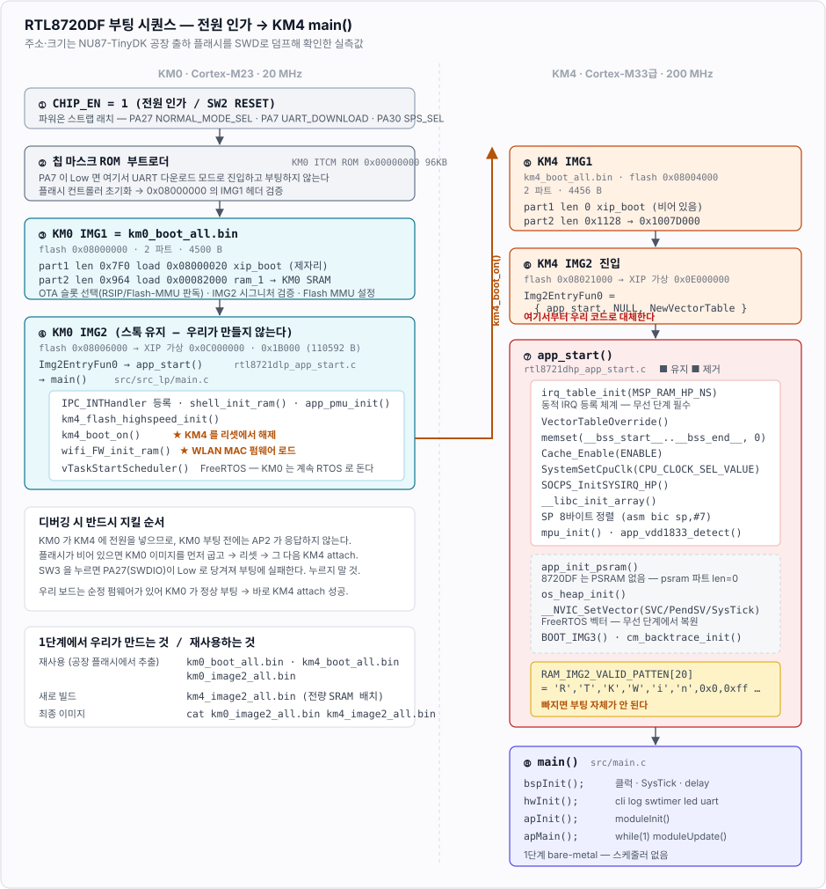

# 06. 부팅 흐름과 이미지 포맷

이 문서의 모든 주소·크기는 **라이브 칩에서 SWD로 읽은 실측값**이다. 추측이 아니다.
(공장 출하 펌웨어가 들어 있는 상태에서 `dump_image 0x08000000 0x40000` 후 헤더 체인을 파싱)

## 6.1 부팅 시퀀스 — 전원 인가부터 `main()` 까지



**핵심 결론 3개**

1. **KM0 는 선택사항이 아니다.** KM4 를 리셋에서 풀어주고(`km4_boot_on()`), 플래시 클럭을 설정하고,
   WLAN MAC 펌웨어를 로드하는 주체다. → **KM0 이미지는 스톡을 그대로 쓴다.**
2. **부트로더도 2파트 체인이다.** KM0 IMG1 = xip_boot(제자리) + ram_1(KM0 SRAM `0x82000`),
   KM4 IMG1 = xip_boot(**길이 0**) + ram(`0x1007D000` = `BOOTLOADER_RAM_S`).
   → 블롭을 추출할 때 첫 파트만 자르면 부팅하지 않는다. (실제로 한 번 틀렸다)
3. **우리가 대체하는 지점은 ⑥~⑧ 뿐이다.** ①~⑤ 는 전부 스톡 재사용.

## 6.2 32바이트 이미지 헤더

각 서브이미지 앞에 32바이트 헤더가 붙는다 (`gnu_utility/prepend_header.sh`가 생성):

| 오프셋 | 크기 | 내용 |
|---|---|---|
| `0x00` | 8 | **시그니처** |
| `0x08` | 4 | 이미지 길이 (LE, 헤더 제외) |
| `0x0C` | 4 | 로드 주소 (LE) — ELF 심볼에서 가져옴 (`__ram_image2_text_start__` 등) |
| `0x10` | 16 | 예약 (`0xFF` 채움) |

**시그니처 2종 (실측 확인)**

| 바이트열 | u32 쌍 | 용도 |
|---|---|---|
| `99 99 96 96 3F CC 66 FC` | `0x96969999` `0x3FCC66FC` | **IMG1** (부트로더 / `ram_1.bin` / `xip_boot.bin`) |
| `38 31 39 35 38 37 31 31` | — (ASCII **`"81958711"`**) | **IMG2** (애플리케이션) |

실측 원본 바이트:
```
0x08000000: 99 99 96 96 3f cc 66 fc  f0 07 00 00  20 00 00 08
            └── IMG1 시그니처 ──┘    len=0x7F0    load=0x08000020

0x08006000: 38 31 39 35 38 37 31 31  00 7a 01 00  20 00 00 0c
            └── IMG2 "81958711" ─┘   len=0x17A00  load=0x0C000020
```

부트로더는 **헤더 체인을 순차적으로 걸어가며**(현재 이미지 끝 = 다음 헤더 시작)
유효하지 않은 시그니처를 만나면 멈춘다.

## 6.3 플래시 메모리 맵 (4MB)

슬롯 경계는 `fwlib/usrcfg/rtl8721d_bootcfg.c` 의 `OTA1_START` / `OTA2_START` 가 정한다.

```
물리 주소                    크기      사용      내용
──────────────────────────────────────────────────────────────────────────────
0x08000000 ┌──────────────┐    8 KB    4.4 KB   KM0 부트로더  km0_boot_all.bin
           │              │                     SRAM 으로 복사되어 실행 (XIP 아님)
0x08002000 ├──────────────┤    4 KB       —     예약 FLASH_RESERVED_DATA_BASE
           │              │                     전부 0xFF
0x08003000 ├──────────────┤    4 KB       —     시스템 데이터 FLASH_SYSTEM_DATA_ADDR
           │              │                     전부 0xFF
0x08004000 ├──────────────┤    8 KB    4.4 KB   KM4 부트로더  km4_boot_all.bin
           │              │                     SRAM(0x1007D000) 으로 복사되어 실행
0x08006000 ╞══════════════╡ 1024 KB  135.0 KB   ★ OTA1 슬롯   km0_km4_image2.bin
           │              │                       KM0 image2    92.0 KB
           │              │                       KM4 image2    43.0 KB  ← 우리 펌웨어
           │              │                     WiFi 를 켜면 KM4 image2 가 430.4 KB
0x08106000 ╞══════════════╡ 1024 KB       —     OTA2 슬롯 (미사용)
0x08206000 ├──────────────┤ 1992 KB       —     빈 영역 0xFF
0x083F8000 ╞══════════════╡   32 KB              ★ 끝단 데이터 영역 (예약)
           │              │   12 KB       —       FTL 3섹터 — BLE 본딩키용, 아직 미사용
           │              │   12 KB       —       여유
0x083FE000 │              │    4 KB    1872 B     NVS 섹터 A   hw/driver/nvs.c
0x083FF000 │              │    4 KB    1872 B     NVS 섹터 B   (핑퐁)
0x08400000 └──────────────┘
                            ─────────
                             4096 KB   = 4 MB
```

### OTA1 슬롯 내부

```
0x08006000  ┌ km0_image2_all.bin ────────────────────────────  94208 B (92.0 KB)
            │  [hdr 32B] xip    84064 B  -> 가상 0x0C000020   KM0 XIP
            │  [hdr 32B] ram     9392 B  -> 0x00083000        KM0 SRAM
            │  4KB 패딩 (0x16D50 -> 0x17000)
0x0801D000  ├ km4_image2_all.bin ───────────────────────────  44056 B (43.0 KB)
            │  [hdr 32B] xip    41848 B  -> 가상 0x0E000020   KM4 XIP
            │  [hdr 32B] ram     2112 B  -> 0x10005000        KM4 SRAM
            │  [hdr 32B] psram      0 B  -> 0x02000020        PSRAM 없음
            └
```

KM4 는 WiFi 빌드(`-DNU87_WIFI=ON`)에서 xip 388776 B / ram 51872 B 로 커진다.
KM0 는 `firm-sdk/tools/build_km0.py` 가 SDK 를 빌드해 만든 것이라 SDK 커밋이
바뀌지 않는 한 크기도 고정이다.

두 파일의 **단순 concat** 이고 각 파트가 자기 32바이트 헤더를 갖는다. 총 5파트 체인이다.

### KM4 파트의 물리 주소는 KM0 이미지 크기가 정한다

KM0 부트로더(`bootloader/boot_flash_lp.c`)가 MMU 두 개를 건다:

```c
/* Mapping KM0 IMG2 to OTA1 */
BOOT_FLASH_OTA_MMU(0, 0x0C000000, OTA_Region[ota_idx],          &LsSize);
/* Mapping KM4 IMG2 to OTA1, should be 4 KB aligned */
BOOT_FLASH_OTA_MMU(1, 0x0E000000, OTA_Region[ota_idx] + LsSize, NULL);
```

`LsSize` 는 KM0 이미지가 자기 헤더로 알려주는 크기를 4KB 로 올린 값이다:

```c
ImgSize = Img2Hdr->image_size + Img2DataHdr->image_size + IMAGE_HEADER_LEN * 2;
ImgSize = (((ImgSize - 1) >> 12) + 1) << 12;
```

우리 보드 검산:

```
84064 + 9392 + 64 = 93520 (0x16D50)  -> 4KB 올림 94208 (0x17000)
                                      == km0_image2_all.bin 파일 길이  ✓
KM4 물리 = 0x08006000 + 0x17000 = 0x0801D000
```

> **가상주소 `0x0C000000` / `0x0E000000` 는 고정이다.** KM0 부트로더의
> `__ls_flash_text_start__` / `__hs_flash_text_start__` 에서 오는 컴파일 타임 상수라
> 이미지 크기와 무관하다. KM0 블롭이 바뀌어도 부트로더가 물리 주소를 알아서 따라온다.
>
> **지켜야 하는 것은 `km0_image2_all.bin` 의 파일 길이다.** 위 계산값과 다르면
> KM4 파트가 부트로더가 보는 자리에 없어 이렇게 무한 대기한다:
> ```
> AmebaD Flash Memory Layout is modified!
> Please download km0_km4_image2.bin instead of km0_image2_all.bin & km4_image2_all.bin!!
> ```
> `make_image.py` 가 부트로더와 같은 식으로 계산해 굽기 전에 검사한다.

### ★ psram 파트를 빼먹으면 안 된다

KM0 부트로더는 **KM4 이미지에 한해** part2 뒤에서 psram 헤더를 한 번 더 읽어
MMU 매핑 크기에 더한다:

```c
if(idx == 1) {
    PsramHdr = (IMAGE_HEADER *)(vAddr + ImgSize);
    ImgSize += (IMAGE_HEADER_LEN + PsramHdr->image_size);
}
```

이 파트가 없으면 빈 플래시(`0xFF`)를 헤더로 읽어 `image_size` 가 `0xFFFFFFFF` 가 된다.
u32 오버플로 덕에 결과적으로 한 페이지 더 크게 잡혀 동작은 하지만 의도한 동작이 아니다.
**공장 이미지도 길이 0 인 psram 파트를 갖는다.** 우리도 넣는다.

## 6.3.1 실측 파트 체인 (공장 출하 펌웨어)

`firm-sdk/tools/extract_blobs.py` 로 헤더 체인을 파싱한 결과다:

| 물리 주소 | sig | len | load addr | 정체 |
|---|---|---|---|---|
| `0x08000000` | IMG1 | `0x0007F0` | `0x08000020` | **KM0 IMG1 · xip_boot** — 제자리 XIP |
| `0x08000810` | IMG1 | `0x000964` | `0x00082000` | **KM0 IMG1 · ram_1** → KM0 SRAM |
| `0x08002000` | — | — | — | BACKUP (4K) — 전체 `0xFF` |
| `0x08003000` | — | — | — | System Data / XIPSYS (4K) — 전체 `0xFF` |
| `0x08004000` | IMG1 | **`0x000000`** | `0x08004020` | **KM4 IMG1 · xip_boot** — 길이 0 (본체 ROM) |
| `0x08004020` | IMG1 | `0x001128` | `0x1007D000` | **KM4 IMG1 · ram** → `BOOTLOADER_RAM_S` |
| `0x08006000` | IMG2 | `0x017A00` | **`0x0C000020`** | **KM0 IMG2 · xip** (KM0 XIP 가상) |
| `0x0801DA20` | IMG2 | `0x002790` | `0x00083000` | **KM0 IMG2 · ram** (KM0 SRAM) |
| ↳ `0x080201D0`~`0x08020FFF` | — | — | — | **4KB 경계 패딩** (`pad.sh`) |
| `0x08021000` | IMG2 | `0x010B70` | **`0x0E000020`** | **KM4 IMG2 · xip** (KM4 XIP 가상) |
| `0x08031B90` | IMG2 | `0x005244` | `0x10005000` | **KM4 IMG2 · ram** (`BD_RAM_NS`) |
| `0x08036DF4` | IMG2 | **`0x000000`** | `0x02000020` | **KM4 IMG2 · psram** — **len=0 → PSRAM 없음 확인** ✓ |
| `0x08106000` | — | — | — | OTA2 슬롯 시작 (비어 있음) |

**읽어낼 수 있는 사실들**

- `km0_km4_image2.bin` = `km0_image2_all.bin` ‖ `km4_image2_all.bin` 의 **단순 concat**이고,
  각 파트(`xip` / `ram` / `psram`)가 자기 헤더를 갖는다. 총 **5 파트 체인**.
- **`km0_image2_all.bin`은 4KB 경계로 패딩된다** (`0x08006000`~`0x08021000` = `0x1B000` = 110592 B).
  우리 이미지 생성 스크립트도 이걸 지켜야 한다.
- **PSRAM 파트 길이가 0** → RTL8720DF에 PSRAM이 없다는 것이 이미지로도 확인된다.
- OTA2(`0x08106000`)는 비어 있다 → 현재 단일 슬롯 운용.
- **부트로더도 2파트다.** KM4 IMG1의 `xip_boot`가 길이 0인 대신 `ram` 파트(4392 B)가
  `BOOTLOADER_RAM_S`(`0x1007D000`)에 올라간다. 즉 KM4 부트로더는 **SRAM에서 실행**된다.

### 공장 플래시에서 블롭 추출 — SDK 빌드 없이 시작하기

SDK를 빌드하지 않고도 부팅에 필요한 블롭을 **공장 출하 플래시에서 그대로 뽑아낼 수 있다.**
SWD로 4MB 전체를 백업했으므로 (`backup/nu87_factory_flash_4MB.bin`) 거기서 잘라내면 된다:

```bash
$ python3 firm-sdk/tools/extract_blobs.py backup/nu87_factory_flash_4MB.bin -o firm-sdk/prebuilt/

=== 블롭 경계 ===
  km0_boot_all.bin   = flash[0x08000000 .. 0x08001194)  2 파트
  km4_boot_all.bin   = flash[0x08004000 .. 0x08005168)  2 파트
  km0_image2_all.bin = flash[0x08006000 .. 0x08021000)  = 0x1B000 (110592 B)
    4KB 정렬: OK (패딩 포함)

=== 출력 ===
  km0_boot_all.bin           4500 B  sha256:453c880307fc3890
  km4_boot_all.bin           4456 B  sha256:05fbf808d43113ea
  km0_image2_all.bin       110592 B  sha256:9595267fe00aa42d
```

**장점**: asdk 툴체인 설치와 SDK 참조 빌드를 1단계에서 건너뛸 수 있다. 개발 시작이 훨씬 빠르다.

**한계 (무선 단계에서 해결해야 함)**: 이 KM0 이미지는 **공장 펌웨어의 SDK 버전**으로 빌드된 것이다.
1단계 bare-metal LED/CLI 는 IPC를 전혀 쓰지 않으므로 문제가 없지만,
무선 단계에서는 KM4 코드와 KM0 이미지의 **IPC 테이블 레이아웃·공유메모리 구조가 일치해야 한다.**
→ 무선에 들어갈 때 SDK를 실제로 빌드해 **버전이 맞는 KM0 이미지**로 교체한다. [04](04-sdk-vendoring.md)

## 6.4 OTA 슬롯과 Flash MMU

`fwlib/usrcfg/rtl8721d_bootcfg.c`:
```c
/* KM0 & KM4 IMG2 are combined, users only need to set the start address of KM0 IMG2 */
u32 OTA1_START = 0x08006000;   /* LS_IMG2_OTA1_ADDR */
u32 OTA2_START = 0x08106000;   /* LS_IMG2_OTA2_ADDR */
u8  Force_OTA1_GPIO = 0xFF;    /* OTA1 강제 부팅 핀, 0xFF = 사용 안 함 */
u8  Boot_Log_En     = 0;
```

**핵심 트릭**: Flash MMU 가 OTA1/OTA2 두 물리 슬롯을 **같은 가상주소**
(`0x0C000000` KM0 / `0x0E000000` KM4)로 매핑한다. 그래서 **동일 바이너리가 어느 슬롯에서든
그대로 부팅한다** — 슬롯별 재링크가 필요 없다.

`misc/rtl8721d_ota.c`의 `ota_get_cur_index()`는 `RSIP_FLASH_MMU` 레지스터를 읽어
지금 실행 중인 이미지가 OTA1/OTA2 중 어디서 매핑됐는지 판단한다.

> ⚠️ **그래서 물리주소(`0x08xxxxxx`)를 코드에 하드코딩하면 안 된다.** OTA2 부팅 시 깨진다.

### XIP 매핑 실측 증명

```
SWD로 가상 0x0E000020 읽기 : 20032102 be1ef000 2101b508 f0002003 f44ffef9 ...
덤프의 물리 0x08021020     : 20032102 be1ef000 2101b508 f0002003 f44ffef9 ...   ← 동일

SWD로 가상 0x0C000020 읽기 : f004b510 6b00ff7d bf00bd10 f004b510 6c03ff77 ...
덤프의 물리 0x08006020     : f004b510 6b00ff7d bf00bd10 f004b510 6c03ff77 ...   ← 동일
```

그리고 KM4 halt 시 `pc: 0x0e002ca6` — **XIP 가상 주소에서 실행 중**이다.

### 6.4.1 NVS 영역 — OTA 슬롯 밖의 고정 주소

`src/hw/driver/nvs.c` 는 플래시 **맨 끝 8KB**, `0x083FE000` 부터 4KB 섹터 두 개를 쓴다
(`HW_NVS_FLASH_OFFSET` = `0x003FE000`, `hw_def.h`). 끝에 붙여야 앞쪽이 커져도
— OTA 슬롯을 키우거나 파일시스템을 넣어도 — 부딪히지 않는다.

앞의 경고는 **OTA 슬롯 안**을 가리킬 때의 이야기다. NVS 는 OTA1/OTA2 어느 쪽도 아니고
MMU 매핑도 받지 않는 영역이라 물리 주소를 그대로 쓴다. 그래야 OTA 로 슬롯이 바뀌어도
설정이 남는다.

저장할 때마다 쓰지 않은 섹터를 지우고 순번(`seq`)을 올려 기록한다. 쓰는 도중 전원이
끊겨도 직전 것이 살아남고, 마모도 두 섹터에 나뉜다.

**끝단 32KB 를 통째로 예약해 둔 이유**는 BLE 때문이다. Realtek BT 스택은 본딩키를
FTL 에 저장하고, `rtl8721dhp_intfcfg.c` 가 `ftl_phy_page_num = 3` — 4KB 섹터 3개를
요구한다. 시작 주소(`ftl_phy_page_start_addr`)는 **우리가 정해서 알려줘야 한다**.
NVS 바로 앞 `0x083F8000` 이 그 자리다.

> ⚠️ **XIP 실행 중에는 `FLASH_RxData()` 를 부르면 안 된다.** SPIC 를 user 모드로
> 돌리는 ROM 함수라 그 순간 명령어 인출이 끊겨 코어가 그대로 멈춘다.
> 실제로 부팅이 `FLASH_RxData` 내부(`0x1010b195` + `0x8d`)에서 멎었다.
>
> 읽기는 `SPI_FLASH_BASE + offset` 메모리맵으로 한다. 플래시 4MB 전체가
> `0x08000000` 에 그대로 보이고, 이 접근은 XIP 인출과 같은 auto 모드라 안전하다.
> SDK 의 `flash_stream_read()` 도 같은 방식이다.
> 쓰기·소거는 `FLASH_EraseXIP()` / `FLASH_TxData256BXIP()` 를 쓴다. 이들은
> `FLASH_Write_Lock()` 안에서 돌고 끝에 `Cache_Flush()` 까지 해 주므로
> 직후의 메모리맵 읽기가 최신 내용을 본다.

## 6.5 KM4 진입점 — 우리가 대체할 부분

`fwlib/ram_hp/rtl8721dhp_app_start.c` (500줄) 끝부분:

```c
IMAGE2_VALID_PATTEN_SECTION
const u8 RAM_IMG2_VALID_PATTEN[20] = {
    'R', 'T', 'K', 'W', 'i', 'n', 0x0, 0xff,
    (FW_VERSION&0xff), ((FW_VERSION >> 8)&0xff),
    (FW_SUBVERSION&0xff), ((FW_SUBVERSION >> 8)&0xff),
    (FW_CHIP_ID&0xff), ((FW_CHIP_ID >> 8)&0xff),
    (FW_CHIP_VER), (FW_BUS_TYPE),
    (FW_INFO_RSV1), (FW_INFO_RSV2), (FW_INFO_RSV3), (FW_INFO_RSV4)
};

IMAGE2_ENTRY_SECTION
RAM_START_FUNCTION Img2EntryFun0 = {
    app_start,
    NULL,           // BOOT_RAM_WakeFromPG
    (u32)NewVectorTable
};
```

> **`RAM_IMG2_VALID_PATTEN[20]` = `"RTKWin\0\xff..."` 는 부트로더 검증용이라 반드시 있어야 한다.**
> 이걸 빼먹으면 부팅하지 않는다. `rtl8721dhp_startup.c`는 8줄(저작권 헤더)뿐이므로 볼 필요 없다.

`app_start()`가 하는 일 (순서 그대로):

```c
void app_start(void)
{
    irq_table_init(MSP_RAM_HP_NS);   /* ★NS 벡터테이블 초기화 — 동적 IRQ 등록 체계 */
    VectorTableOverride();

    app_section_init();
    _memset((void *) __bss_start__, 0, (__bss_end__ - __bss_start__));   /* BSS clear */

#if configENABLE_TRUSTZONE
    BOOT_IMG3();
#endif
    Cache_Enable(ENABLE);                        /* ★비보안 캐시 활성화 */
    DBG_PRINTF(... BOOT_Reason());
    SystemSetCpuClk(CPU_CLOCK_SEL_VALUE);        /* ★CPU 클럭 */
    SOCPS_InitSYSIRQ_HP();

    if (psram_dev_config.psram_dev_enable) app_init_psram();   /* 8720DF: FALSE */

    os_heap_init();                              /* FreeRTOS heap5 */
    __NVIC_SetVector(SVCall_IRQn,  vPortSVCHandler);      /* FreeRTOS 벡터 */
    __NVIC_SetVector(PendSV_IRQn,  xPortPendSVHandler);
    __NVIC_SetVector(SysTick_IRQn, xPortSysTickHandler);

    if (psram_dev_config.psram_dev_enable) { app_psram_load_ns(); app_psram_load_s(); }

    __libc_init_array();                         /* ★C++/init_array */
    __asm("mov r0, sp\n bic r0, r0, #7\n mov sp, r0\n");   /* ★SP 8바이트 정렬 */

    mpu_init(); app_mpu_nocache_init(); app_mpu_s_nocache_init();
    app_vdd1833_detect();                        /* ★1.8V/3.3V 판별 */
    memcpy_gdma_init();
    assert_param(sizeof(RRAM_TypeDef) <= 0xB0);
    app_driver_call_os_func_init();
    app_init_debug();
    cm_backtrace_init("target_img2", "HW v1.0", "SW v1.0");

    main();                                      /* ← project/.../src/main.c */
}
```

### 계획 수정 — 자작보다 복사·삭감이 안전하다

당초에는 `src/bsp/device/app_entry.c`를 처음부터 작성할 계획이었으나,
`RAM_IMG2_VALID_PATTEN` / `Img2EntryFun0` / `NewVectorTable` / `irq_table_init()` 처럼
**틀리면 부팅 자체가 안 되는 요소가 몰려 있다.**

→ **`rtl8721dhp_app_start.c`를 `src/bsp/device/`로 복사한 뒤 잘라내는 방식**으로 간다.

| 유지 | 제거 (1단계) |
|---|---|
| `Img2EntryFun0`, `RAM_IMG2_VALID_PATTEN` | PSRAM 초기화/로드 (`app_init_psram`, `app_psram_load_*`) |
| `irq_table_init()`, `VectorTableOverride()` | FreeRTOS 벡터 3개 (`vPortSVCHandler` 등) |
| BSS clear, `Cache_Enable`, `SystemSetCpuClk` | `os_heap_init()` → newlib `_sbrk` 로 대체 검토 |
| `__libc_init_array()`, SP 8바이트 정렬 | TrustZone `BOOT_IMG3()` |
| `mpu_init()`, `app_vdd1833_detect()` | `cm_backtrace_init()` |
| `SOCPS_InitSYSIRQ_HP()` | `app_driver_call_os_func_init()` (WiFi 드라이버용) |

**부수 효과 (좋은 것)**: `irq_table_init()`을 유지하면 **동적 IRQ 등록 체계
(`InterruptRegister()`)를 처음부터 갖게 된다.** 이건 무선 단계에서 WiFi/BT/IPC/GDMA IRQ를
붙일 때 반드시 필요한데, 1단계에서 미리 확보하는 셈이다.

무선 단계에서 되살릴 것: FreeRTOS 벡터, `os_heap_init()`, `app_driver_call_os_func_init()`,
그리고 KM4 `main()`의 `IPC_INTHandler` 등록 + `ipc_table_init()`.

## 6.6 링커스크립트

SDK 원본:
- `project_hp/asdk/rlx8721d_layout_is.ld` — `MEMORY{}` 리전 정의 (비 TrustZone)
- `project_hp/asdk/ld/rlx8721d_img2_is.ld` — 애플리케이션 섹션 배치
- `project_hp/asdk/ld/rlx8721d_rom_symbol_acut.ld` — **ROM 심볼 (`symbol = 0xADDR;` 나열)**

`rom_symbol_acut.ld`는 평문 텍스트라 **어떤 GCC로도 그대로 쓸 수 있다.**
이것이 표준 arm-none-eabi-gcc 로 갈 수 있는 결정적 이유다.

### 우리 링커스크립트 — 두 가지 배치

```
src/bsp/ldscript/nu87_km4_img2.ld        전량 SRAM
src/bsp/ldscript/nu87_km4_img2_xip.ld    XIP  (기본)
```

CMake 로 고른다:

```bash
cmake -S . -B build                          # 기본 = xip
cmake -S . -B build -DNU87_LAYOUT=sram
```

| | SRAM 배치 | XIP 배치 (기본) |
|---|---|---|
| `.text` / `.rodata` | `BD_RAM_NS` | `KM4_IMG2` (가상 `0x0E000020`) |
| 진입점 / `.data` / `.bss` / 힙 | `BD_RAM_NS` | `BD_RAM_NS` |
| 이미지 파트 | xip 0B + ram + psram 0B | xip + ram + psram 0B |
| KM4 SRAM 사용 | 40.7 KB | **14.3 KB** |
| GDB `load` | ⭕ | ❌ (UART 로 구워야 한다) |
| 브레이크포인트 | SW BP 무제한 | **HW BP 2개** |

XIP 를 기본으로 둔 이유는 무선 라이브러리다. `lib_wlan.a` 만 해도 text+rodata 가
422 KB 라 전량 SRAM(476 KB) 배치로는 시작조차 할 수 없다. XIP 면 코드가 전부
플래시에 있으므로 SRAM 462 KB 가 통째로 버퍼용으로 남는다.

SRAM 배치는 반복 개발용으로 남겨 둔다. 플래시를 건드리지 않고 GDB `load` 로 바로
올릴 수 있고 소프트웨어 브레이크포인트를 쓸 수 있다.

**반드시 이식해야 하는 것 — `.module` 섹션** (두 배치 공통):
```ld
. = ALIGN(8);
_smodule = .;
KEEP (*(.module))
KEEP (*(.module*));
_emodule = .;
```
`ap/modules/module.c` 의 `moduleInit()` 이 이 심볼로 모듈을 탐색한다:
```c
info.count    = ((int)&_emodule - (int)&_smodule) / sizeof(module_t);
info.p_module = (module_t *)&_smodule;
```
빠지면 모듈이 하나도 등록되지 않고 `ap` 의 `updateLED()` 도 호출되지 않는다.

**`.version` 은 고정번지가 아니라 이미지 상대 오프셋으로 옮겼다.**
STM32 판은 `0x08000400` 절대번지에 `firm_ver_t` 를 두었는데, OTA1/OTA2 가 같은
가상주소로 매핑되는 이 칩에서는 성립하지 않는다. 대신 **RAM 파트 시작 +32** 에 고정한다:
```ld
. = __ram_image2_text_start__ + 32;
__image2_version__ = .;
KEEP(*(.version))
```
두 배치가 같은 규칙을 쓰므로 부트로더나 호스트 툴이 배치를 구분할 필요가 없다.

## 6.7 이미지 생성 파이프라인

`firm-sdk/tools/make_image.py` (CMake POST_BUILD 에서 호출). 벤더의 `prepend_header.sh`
와 플랫폼별 `checksum` 바이너리를 쓰지 않는다 — bash 전용이라 크로스플랫폼이 아니고,
32바이트 헤더는 `struct.pack` 몇 줄이면 된다.

```
1) 배치 판별      .map 의 __flash_text_start__ 가 0x0E.. 대면 XIP
2) 섹션 추출      objcopy -O binary
     ram 파트  .ram_image2.entry / .text / .data   (+ SRAM 배치면 .ARM.extab/.exidx)
     xip 파트  .xip_image2.text / .ARM.extab / .ARM.exidx
3) 헤더 부착      [hdr]xip + [hdr]ram + [hdr]psram(0B)
     로드 주소는 .map 의 __flash_text_start__ / __ram_image2_text_start__ 에서 읽는다
4) KM0 블롭과 결합
     km0_image2_all.bin ‖ km4_image2_all.bin  ->  km0_km4_image2.bin
     ※ KM0 블롭 길이가 부트로더 계산값과 같은지 검사한다 (§6.3)
5) 검증           페이로드 +32 에서 firm_ver_t 를 되읽어 이름/버전을 출력
```

출력 예 (XIP 배치):

```
  펌웨어      NU87-TINYDK  V260808R1   (페이로드 +32, addr 0x10005000)
  배치        XIP (코드는 플래시에서 실행)
  part1 xip     26488 B  load 0x0E000020  (__flash_text_start__)
  part2 ram       688 B  load 0x10005000  (__ram_image2_text_start__)
  km4_image2    27272 B
  km0(스톡)    110592 B
  최종 이미지  137864 B  -> km0_km4_image2.bin  (flash 0x08006000)
```

플래싱 주소:

| 파일 | 주소 |
|---|---|
| `firm-sdk/prebuilt/km0_boot_all.bin` | `0x08000000` |
| `firm-sdk/prebuilt/km4_boot_all.bin` | `0x08004000` |
| `build/km0_km4_image2.bin` | `0x08006000` (OTA1) |

> **원시 `.bin`/`.elf`를 `0x08000000`에 그냥 구울 수는 없다.** ROM/부트로더가 32바이트
> 헤더(시그니처+길이+로드주소)를 요구한다.
>
> **XIP 배치에서는 SWD 로 플래시를 쓸 수 없다.** OpenOCD 에 RTL872x flash bank 드라이버가
> 없어서 `load` 가 실패하고, XIP 영역 쓰기는 D-캐시만 오염시켜 타깃이 불안정해진다
> (실측: `Load failed` -> `target not halted`, 리셋으로 복구). UART 로 굽는다.
> SRAM 배치 이미지는 GDB `load` 로 직접 올려 디버깅할 수 있다.

## 6.8 참고 — 보안 기능 (현재 미사용)

`project/realtek_amebaD_va0_example/GCC-RELEASE/security_config.sh`에서 켠다:

| 기능 | 내용 |
|---|---|
| `RSIP_ENABLE` | 플래시 온더플라이 복호화. `EncTool rsip  <out> <addr> $RSIP_KEY $RSIP_IV` |
| `SBOOT_ENABLE` | 보안 부팅. `EncTool sboot ... key_pair.txt $SBOOT_SEED` |
| `RDP_ENABLE` | 읽기 방지 (img3) |
| `SIMG2_ENABLE` | IMG2 서명 |

우리 모듈은 이 중 아무것도 켜져 있지 않다 (실측: 헤더가 평문 시그니처, SWD 접근 자유).
OTA 패키징은 `prepend_ota_header.sh`가 24바이트 헤더(`OTA_SIGN=0x4F544131 "OTA1"`)를 붙여
`OTA_All.bin`을 만든다 — 무선 단계에서 다룬다.
